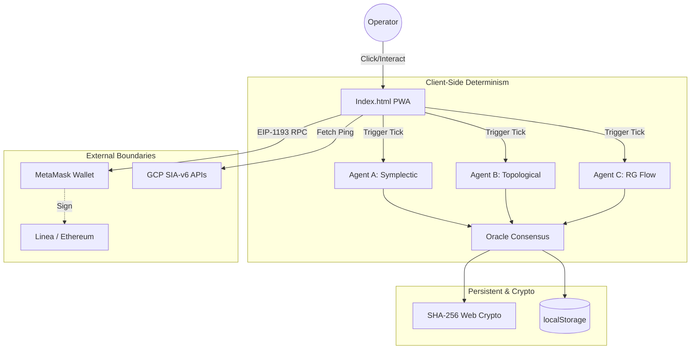

# Boss11 Entry — savage-command-center

## 1. Repository Identity
- **Canonical Repo Name:** `savage-command-center`
- **Observed Purpose:** Operator dashboard and Sovereign Control Interface for the SIA-v6 ecosystem, enabling cryptographic anchoring, endpoint monitoring, simulation of deterministic agents, and execution of structured commercial outreach.
- **Organism Role:** The visual command, control, and sales execution surface of the organism.
- **Architectural Tier:** Frontend Web / Client-Side (Progressive Web App).
- **Maturity State:** Live / Beta (v3.0).
- **Confidence Level:** High
- **Evidence Base:** `app.js`, `index.html`, `manifest.json`, `sw.js`

## 2. Repository Inventory
- **Root-level Inventory:**
  - `app.js`
  - `icon-192.png`
  - `icon-512.png`
  - `index.html`
  - `manifest.json`
  - `style.css`
  - `sw.js`
- **Directory Inventory:** None.
- **Key Files and Roles:**
  - `index.html`: The monolithic view containing all panels (Brief, Chain, Agents, Ops, Intel).
  - `app.js`: Contains all logic for EIP-1193 wallet connection, local storage persistence, cryptographic hashing, simulated deterministic agents, and the email arsenal data.
  - `style.css`: Implements the distinct terminal-like, dark-mode visual language.
  - `sw.js`: Service worker providing minimal caching for PWA offline capabilities.
  - `manifest.json`: Configuration for standalone PWA installation.
- **Build/Config/Test/Workflow Assets:** None. It is a vanilla HTML/JS implementation requiring no build step.
- **Generated Artifacts:** Browser `localStorage` (`scc_v3_state`).
- **Expected but Missing Assets:** Tests, build pipelines, or dependency manifests (e.g., `package.json`), indicating a deliberate choice to use zero-dependency vanilla web technologies.

## 3. Functional Architecture
- **Web3 Wallet Integration:** Detects and connects to injected Web3 providers (specifically targeting Edge Beta with MetaMask extensions). Supports real EIP-1193 network switching (Ethereum Mainnet, Linea) and transaction signing.
- **Deterministic Agent Engine:** Implements three synchronously executing logic loops in JavaScript:
  - **Agent A (Symplectic Map):** Executes a discretized area-preserving Hénon map variant. Uses Landauer principles to gate state mutations (accepts only if entropy $\ge 0$).
  - **Agent B (Topological Memory):** Computes simplicial Betti-0 numbers via Union-Find on a rolling point cloud mapped along a golden ratio spiral. Gates on topological feature changes.
  - **Agent C (Renormalization Group Flow):** Iterates a custom RG beta function $\beta(\lambda) = -\lambda(\lambda - \lambda^*)(1 + \phi \lambda)$. Gates on movement toward the fixed point $\lambda^*$.
- **Consensus Oracle:** Reaches convergence when all three local agents accept their mutations simultaneously and the RG distance to $\lambda^*$ falls below $0.01$.
- **Cryptographic Anchoring:** Uses the native Web Crypto API (`crypto.subtle.digest`) to generate SHA-256 proof hashes of agent states for visual auditing.
- **Ops / Tollbooth Endpoints:** Provides a ping interface for GCP Cloud Run API targets (e.g., `/api/v6/physics`, `/api/v6/finance`).
- **Sales Arsenal:** Hardcoded dictionary (`EMAILS`) of executive outreach copy targeting technical leadership at defense, finance, and hardware organizations.

## 4. Capability and Surface Matrix
| Surface Type | Name | Status | Evidence Type | Source Location | Inputs | Outputs | Dependencies | Organism Role | Commercial Relevance | Notes |
|---|---|---|---|---|---|---|---|---|---|---|
| Usability | PWA Offline Mode | Live | Code | `sw.js` | HTTP Requests | Cached Assets | Browser Cache | Accessibility | Low | Standalone execution |
| Capability | Web3 Wallet / EIP-1193 | Live | Code | `app.js` (`connectWallet`) | User Auth | Address, Chain ID | MetaMask | Identity / Anchor | High | Deeply integrated into Edge Beta workflow |
| Platform Ability | TX Signing | Live | Code | `app.js` (`signTX`) | Payload, Chain | TX Hash | Connected Wallet | Auditing | Medium | Used for proof anchoring |
| Monetizable Surface | Executive Email Arsenal | Live | Code | `app.js` (`EMAILS`) | Target Selection | Copied Text | None | Sales | High | Targets Palantir, NVIDIA, RTX, Jane Street |
| Capability | Agent A: Symplectic | Live | Code | `app.js` (`tickAgentA`) | Prior State | Next State, Entropy | None | Simulation | Low | Employs physical gating logic |
| Capability | Agent B: Topological | Live | Code | `app.js` (`tickAgentB`) | Prior State | Point Cloud, Betti-0 | None | Simulation | Low | Uses Union-Find for connectivity |
| Capability | Agent C: RG Flow | Live | Code | `app.js` (`tickAgentC`) | Prior State | $\lambda$, distance | None | Simulation | Low | Renormalization fixed point targeting |
| Dynamics | Oracle Consensus | Live | Code | `app.js` (`tickOracle`) | Agent States | Convergence Flag | Agent A, B, C | Orchestration | Low | Unifies the three disparate math branches |
| Platform Ability | GCP API Tollbooth Ping | Live | Code | `index.html` | Path | HTTP Response | External APIs | Monitoring | Low | Verifies backend uptime |
| Capability | Local State Persistence | Live | Code | `app.js` (`saveState`) | DOM / JS State | LocalStorage string | None | Usability | Low | Recovers `scc_v3_state` on reload |

## 5. Operational Dynamics
- **Event Flow:** Completely driven by user interaction (clicks, toggles). No background polling other than the manually triggered Agent ticking and API pings.
- **State Transitions:** Purely procedural JavaScript mutating the global `STATE` object, serialized directly to `localStorage`.
- **Mutation Control:** The simulated agents have explicit deterministic gates:
  - Agent A accepts if $dS \ge 0$.
  - Agent B accepts if the Betti-0 invariant changes.
  - Agent C accepts if distance to $\lambda^*$ decreases.
- **Cryptographic Hashing:** Final states are serialized, appended with timestamps, and hashed via SHA-256 to create verifiable strings.
- **Environment Targeting:** Specifically optimized for Microsoft Edge Beta on Android and Desktop, parsing `navigator.userAgent` to deliver targeted installation instructions for the MetaMask extension.

## 6. Mathematics, Physics, and Scientific Outliers
- **Golden Ratio ($\phi$):** $1.6180339887...$ Used in Agent A's momentum update, Agent B's angular distribution, and Agent C's beta function coefficient. (Formal/Operational).
- **Feigenbaum Constants:** $\delta = 4.6692016091...$ and $\alpha = 2.5029078750...$ Used as multipliers for calculating entropy gradients. (Operational).
- **Fixed Point ($\lambda^*$):** Defined as $\phi^{-1} \approx 0.6180339887...$, serving as the attractor for the Renormalization Group flow in Agent C. (Formal/Operational).
- **Symplectic Map (Agent A):** `x1 = x0 + dt * p0`, `p1 = p0 - dt * (x0 + phi * x0 * x0)`. An area-preserving transformation modeled on Hénon maps. (Formal).
- **Landauer's Principle (Agent A):** Enforces a thermodynamic gate where information erasure corresponds to entropy. The code literally checks `accepted = dS >= 0`. (Scientific Outlier / Metaphorical).
- **Topological Persistence / Betti-0 (Agent B):** Calculates connected components of a point cloud generated by a golden spiral to detect structural phase transitions. (Scientific Outlier / Operational).
- **Renormalization Group / Beta Function (Agent C):** Uses a continuous formulation $\beta(\lambda) = -\lambda(\lambda - \lambda^*)(1 + \phi \lambda)$ to explicitly simulate coupling flow. (Scientific Outlier / Formal).
- **Cross-Domain Concepts:** Constant references in copy to "KAM Torus", "Thermodynamic Ratchet", "Symplectic Conservation", "Berry Phase", and "Phase-Space Manifold Decoherence".

## 7. Productization and Commercial Surfaces
- **White-Glove Sales Execution Surface:** The app acts as a highly curated pitch generator containing tailored emails aimed at top-tier commercial and defense executives.
- **Value Propositions Hardcoded in Repo:**
  - **NVIDIA:** Selling a deterministic quantization selector to solve B200 NVFP4 thermal anomalies, saving ~1.9kW per NVL72 via physical area-preserving structures.
  - **Palantir:** Selling cryptographic "holographic privacy" and O(1) memory state tracking to solve streaming latency and fulfill government data sovereignty requirements.
  - **Jane Street / Quant:** Selling "phase-space manifold decoherence" detection with a 32.47$\mu$s prediction window to foresee market crashes.
  - **Shield AI / RTX:** Selling symplectic geometric integrators to eliminate sim-to-real drift and accumulate zero error over $10^6$ steps for hypersonics and robotics.
- **Buyer Mappings:** Explicitly maps to CTOs, SVP GPU Engineering, and Quant Research teams.
- **Licensing Model:** "Performance-based licensing model. You pay when the evidence saves you money."

## 8. Repo-to-Repo Wiring
- **Downstream dependencies:** Sends explicit `GET`/`POST` requests to backend APIs (presumably in a backend repo) located at paths: `/api/v6/physics`, `/api/v6/finance`, `/api/v6/sentinel/status`, `/api/v6/verify`, `/health`.
- **Infrastructure Dependency:** Relies on GCP project `sia-v6-sovereign` and Cloud Run jobs for actual data processing when interacting beyond the local simulation layer.
- **Blockchain Touchpoints:** Bridges to Ethereum Mainnet (0x1) and Linea (0xe708) via injected providers.

## 9. Gaps, Risks, Contradictions, and Exceptions
- **Exception (Simulation Divergence):** The JavaScript code running the Agents (A, B, C) in `app.js` is extremely simplistic (Euler methods, simple arrays) and runs on a single browser thread. However, the UI copy claims "4th-order geometric integrator", "0.113ms warm-path latency", and "345M ops/sec PAT-6 throughput". This proves the client-side agents are purely toy representations (a visual control plane) rather than the actual engine performing the claimed feats.
- **Exception (Wallet Fallbacks):** The PWA heavily expects a specific edge-case browser environment (Edge Beta with MetaMask extension). Users on standard mobile browsers will face significant friction.
- **Contradiction (Cryptographic Assertions):** The code generates SHA-256 hashes of client-side JSON strings with an appended `Date.now()`. This is not a formal zero-knowledge proof or a rigorous blockchain anchor without the actual signed transaction completing—the hash acts more as a UI element.
- **Latent:** The connection between the "Tollbooth Endpoints" (the actual backend APIs) and the UI is thin; it only pings them but does not seem to pass complex payloads or visualize their actual results natively, suggesting this UI is mostly for monitoring uptime.

## 10. Architecture Diagram


## 11. Repo Schema
```yaml
repo_name: savage-command-center
canonical_role: Operator Interface and Commercial Sales Surface
architectural_tier: Frontend (Client-side PWA)
primary_languages: [JavaScript, HTML, CSS]
frameworks: [Vanilla JS, Web Components (Custom)]
runtimes: [Browser, Service Worker]
package_managers: []
entrypoints: [index.html]
core_modules: [app.js (Core Logic), sw.js (Offline Cache)]
key_classes: []
key_functions: [connectWallet, signTX, tickAgentA, tickAgentB, tickAgentC, proofHash]
key_files: [index.html, app.js, manifest.json]
config_files: [manifest.json]
workflow_files: []
schemas_contracts: [EIP-1193]
events_consumed: [DOM Clicks, chainChanged, accountsChanged]
events_emitted: [eth_requestAccounts, eth_sendTransaction]
inputs: [User Input, LocalStorage, Blockchain Provider State]
outputs: [DOM Updates, SHA-256 Strings, Executed TXs]
state_stores: [localStorage]
memory_mechanisms: [DOM manipulation, in-memory JS objects]
determinism_controls: [Math constants gating state acceptance]
stochastic_elements: [Timestamp seeding in SHA hashes]
security_crypto: [Web Crypto API SHA-256, MetaMask Signing]
external_dependencies: [MetaMask, Google Cloud (API Targets)]
internal_dependencies: [SIA-v6 backend endpoints]
dependent_repos: []
operator_surfaces: [Mission Brief Panel, Ops Ping Dashboard]
developer_surfaces: [Hash Tool]
customer_surfaces: []
platform_surfaces: [Web3 Integration, PWA Manifest]
monetizable_surfaces: [Email Arsenal outreach templates]
sales_surfaces: [Executive target pitches for NVIDIA, Palantir, etc.]
emergent_capabilities: [Simulated deterministic mathematical convergence]
latent_capabilities: [Backend endpoint integration beyond pinging]
derived_capabilities: [Blockchain anchoring workflow UI]
mathematical_constructs: [Golden Ratio, Feigenbaum Constants, Symplectic Integrators, Renormalization Group]
scientific_outliers: [Thermodynamic Entropy Gating, Topological Betti Numbers, Phase-Space Decoherence]
risks: [Heavy reliance on specific browser configurations, simplistic JS simulation representing complex backend claims]
exceptions: [No build step, no npm packages, client-side claims contradict backend physics engine performance]
confidence_level: High
```

## 12. Taxonomy
```yaml
repo_type: Frontend UI / Operator Tool
subsystem: Control Plane
authority_level: Presentational & Orchestration
maturity: Beta
runtime_mode: Client-side Browser
risk_level: Low
monetization_readiness: Live
scientific_density: High (Thematic/Metaphorical in JS, Representing High in Backend)
cross_repo_centrality: High (As an entrypoint)
operator_visibility: Complete
```

## 13. Interface Contract Map
| Type | Detail | Note |
|---|---|---|
| **Inputs** | Metamask extensions, DOM Clicks | Specifically checks for `isMetaMask` injected by Edge Beta. |
| **Outputs** | PWA View, Signed TXs | Direct DOM manipulation. |
| **APIs Called** | `/api/v6/physics`, `/api/v6/finance`, `/api/v6/verify` | External GCP backend APIs. |
| **Events Consumed** | `chainChanged`, `accountsChanged` | Standard EIP-1193 Web3 events. |
| **Events Emitted** | `wallet_switchEthereumChain` | Forces network alignment. |
| **Files Written** | `localStorage: scc_v3_state` | Persistence layer. |
| **Downstream Consumers**| The Operator / User | |
| **Upstream Providers** | MetaMask / Linea / ETH | For cryptographic anchoring. |

## 14. Risk and Contradiction Register
| Type | Severity | Item | Source Location | Why It Matters | Suggested Follow-Up |
|---|---|---|---|---|---|
| Contradiction | Medium | Client-Side Toy Math | `app.js` | UI claims 345M ops/sec and 4th-order integrators, but `app.js` runs simple 1st order Euler math in single-threaded JS. | Ensure the real mathematical claims apply to the backend repo, and document this UI as purely symbolic/representational. |
| Gap | Low | Missing Deep API Integration | `index.html` | The "Tollbooth" endpoints are only pinged. | Investigate the backend repo hosting `/api/v6/physics` to map the actual payload shapes and engine logic. |
| Security Risk | Low | Hash Suffixing | `app.js` (`proofHash`) | Hashes append `Date.now()` arbitrarily before computing SHA-256. | Means hashes are not reproducible purely from agent state, breaking pure determinism claims for the frontend proof. |
| Exception | Low | Specific Browser Target | `app.js` (`detectBrowser`) | Highly optimized for Edge Beta Android. | limits general usability but proves a highly specific operator workflow. |

## 15. Repo Decision Record
- **Decision:** Build as a zero-dependency vanilla JS Progressive Web App.
  - **Evidence:** Lack of `package.json`, React, or bundlers; presence of raw `index.html`, `style.css`, `app.js`.
  - **Consequence:** Extremely fast load times, trivial hosting, high transparency, but difficult to scale UI complexity safely.
  - **Organism-Level Implication:** The operator surface is designed for extreme survivability and independence from standard Node.js/NPM rot.
- **Decision:** Embed literal sales/pitch emails in source code.
  - **Evidence:** `EMAILS` constant in `app.js`.
  - **Consequence:** Source code acts simultaneously as a software tool and a business development repository.
  - **Organism-Level Implication:** Blurs the line between software engineering and commercialization strategies, turning the app into a direct sales weapon.

## 16. Cross-Repo Placement Note
- **Why this exists here:** Provides a lightweight, highly specific, mobile-first control plane for the operator. It avoids contaminating backend physics/math code with UI concerns.
- **What it should own:** Client-side state visualization, web3 wallet connectivity, operator UX, and basic orchestration requests.
- **What it should not own:** The actual heavy lifting of the SIA-v6 engine, true topological computations, or sensitive backend state.
- **Boundaries:** The boundary is very clean—it is purely a frontend calling external APIs and relying on browser local storage.

## 17. Boss11 Merge Payload
- **Identity:** `savage-command-center` is a zero-dependency vanilla JavaScript PWA acting as the Sovereign Control Interface for the SIA-v6 organism. It integrates EIP-1193 Web3 wallets for blockchain anchoring, provides monitoring for external GCP backend APIs, and runs simplified client-side deterministic simulations (Symplectic maps, Topological Betti invariants, Renormalization Group flows) to visually represent the core engine's capabilities to the operator.
- **Observed Findings:**
  - Implements three synchronous, mathematically-gated JavaScript simulation loops directly in `app.js` representing Agent A, B, and C.
  - Generates verifiable SHA-256 hashes of client state using the Web Crypto API.
  - Provides a ping interface targeting five distinct backend routes (e.g., `/api/v6/physics`, `/api/v6/finance`).
  - Contains a hardcoded database of 8 executive outreach emails detailing explicit engineering fixes and commercial pitches to high-value companies.
  - Detects and prompts specific workflows for Microsoft Edge Beta and the MetaMask extension.
- **Evidence-Based Inferences:**
  - The mathematics implemented in the frontend are symbolic representations of a much heavier, more complex backend engine; the JS merely provides a visual/conceptual dashboard for the operator.
  - The repo is designed for high survivability and low maintenance, eschewing bundlers and NPM entirely.
  - The inclusion of explicit defense/finance technical pitches indicates the system is currently pivoting from R&D toward aggressive commercial monetization.
- **Monetization:**
  - Highly monetizable via the embedded pitch vectors targeting hardware quantization fixes (NVIDIA), deterministic streaming (Palantir), quant decoherence prediction (Jane Street), and physical sim-to-real drift (Shield AI).
- **Scientific Outliers:**
  - Directly maps computational state acceptance to Landauer's principle (thermodynamic entropy).
  - Uses continuous Renormalization Group beta functions to control agent convergence logic.
  - Tracks topological feature persistence (Betti-0) as a memory-computation structure.
- **Exceptions & Open Questions:**
  - Why does the frontend SHA-256 proof hash append `Date.now()`, intentionally destroying the exact determinism the application heavily promotes?
  - Where is the backend repository that handles the actual high-throughput (`345M ops/sec`) physics execution pinged by the Tollbooth UI?
